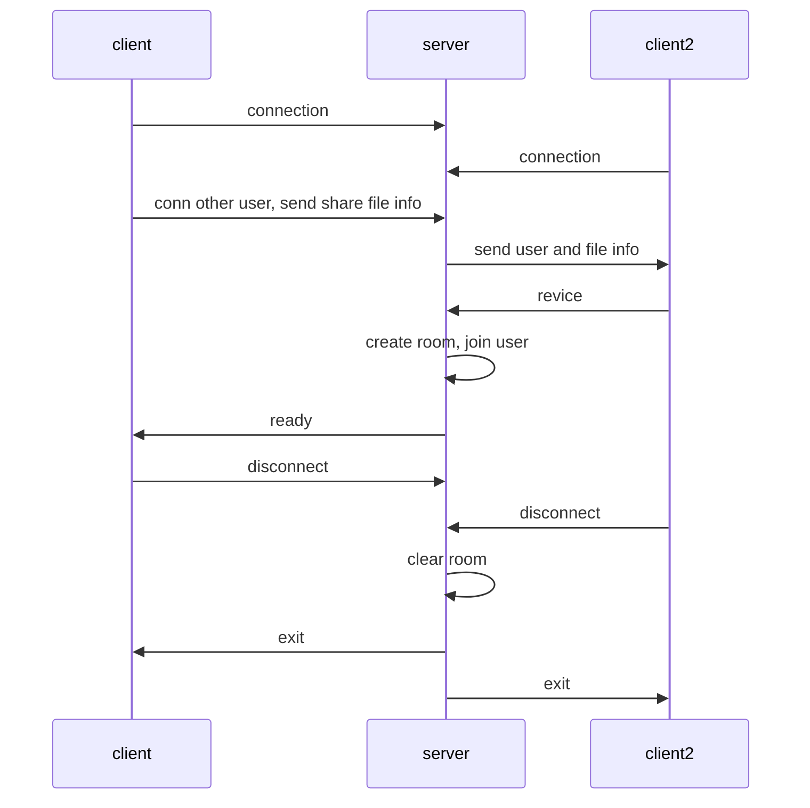

# socket.io + webRTC 文件传输

需求稿：https://doc.huanleguang.com/pages/viewpage.action?pageId=133986775

## 使用方法

1. 启动 server
```
cd server
npm i
npm run start
```

2. 启动页面
```
npm i
npm run serve
```

3. 打开两个页面，传输文件

## TOOD
1. 如何创建点对点的连接？
2. 连接的稳定性
3. 大文件校验
4. STUN / TURN 服务

## 流程

1. 点击 “隔空投送”
2. A 获取用户列表
3. A 点击用户 B，选择文件
4. A 向 B 发起连接请求，并发送文件信息
5. B 确认接收
6. 创建 rtc 连接，发送文件

### socket 服务器交互



## 参考
4. [WebRTC samples](https://webrtc.github.io/samples/)
1. [WebRTC samples Transfer a file](https://webrtc.github.io/samples/src/content/datachannel/filetransfer/)
2. [WebRTC 总结](https://ejin66.github.io/2018/09/03/webrtc-summary.html)
3. [WebRTC中的信令和内网穿透技术 STUN / TURN](https://blog.csdn.net/shaosunrise/article/details/83627828)
5. [A quick cheatsheet for socket.io](https://gist.github.com/alexpchin/3f257d0bb813e2c8c476)
